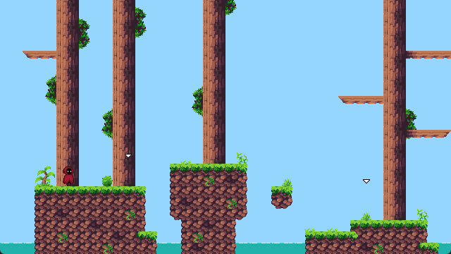

# SFML-test

Small game developed in C++ using the SFML library in order to learn how to develop basic game mechanics of a 2D platformer.
First attempt at structuring a game, the code is a bit messy.

Assets used:
[Tileset](https://anokolisa.itch.io/basic-140-tiles-grassland-and-mines)
[Character](https://penzilla.itch.io/hooded-protagonist) (Added a blurred animation for the dash)
